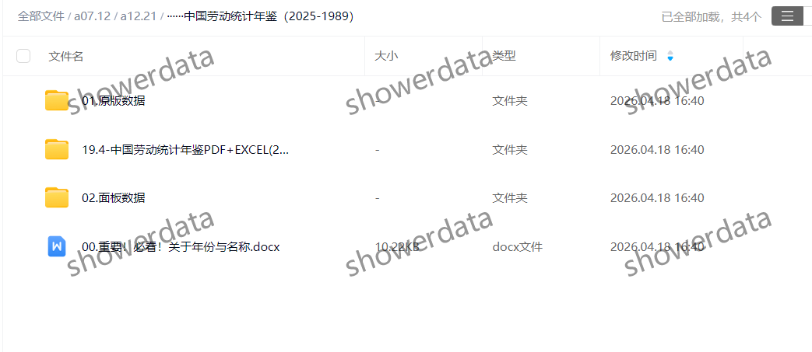
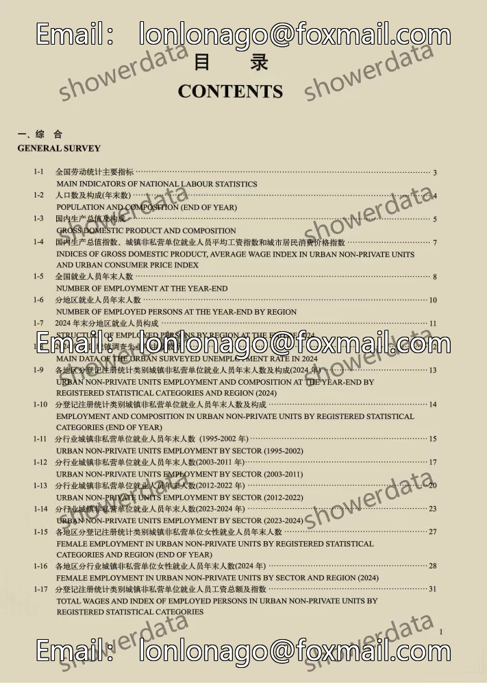
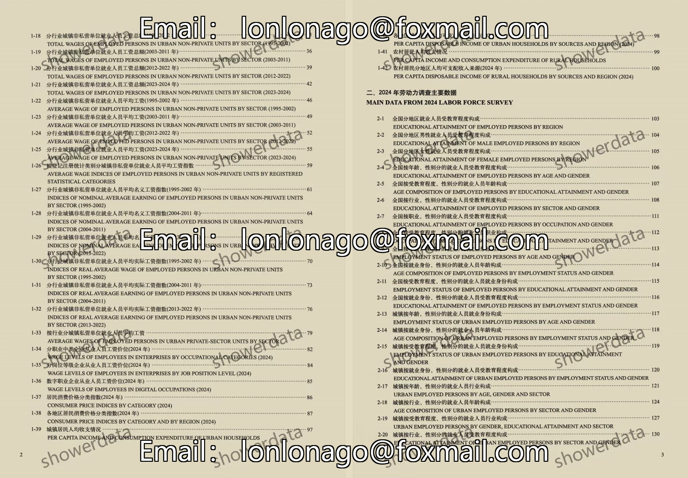
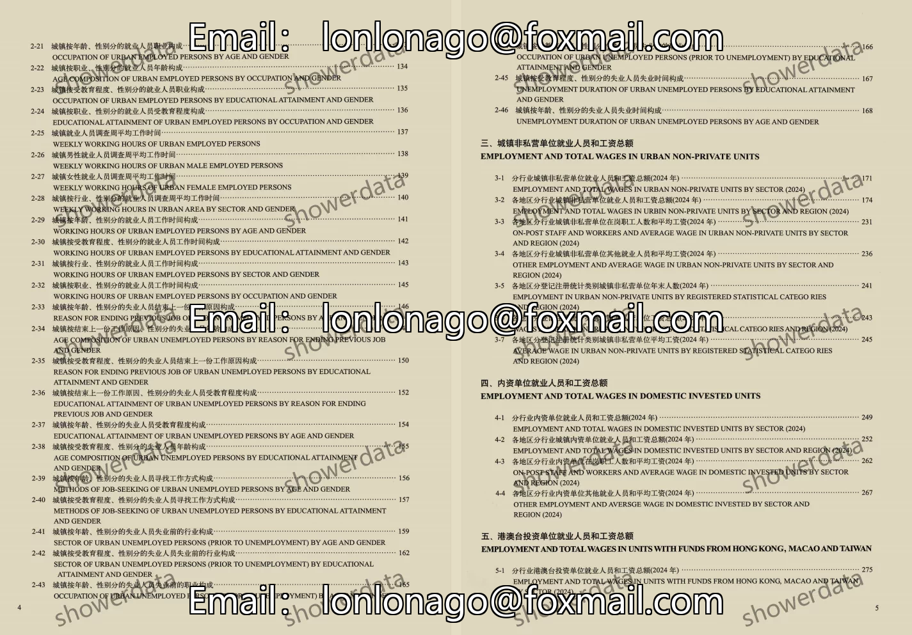
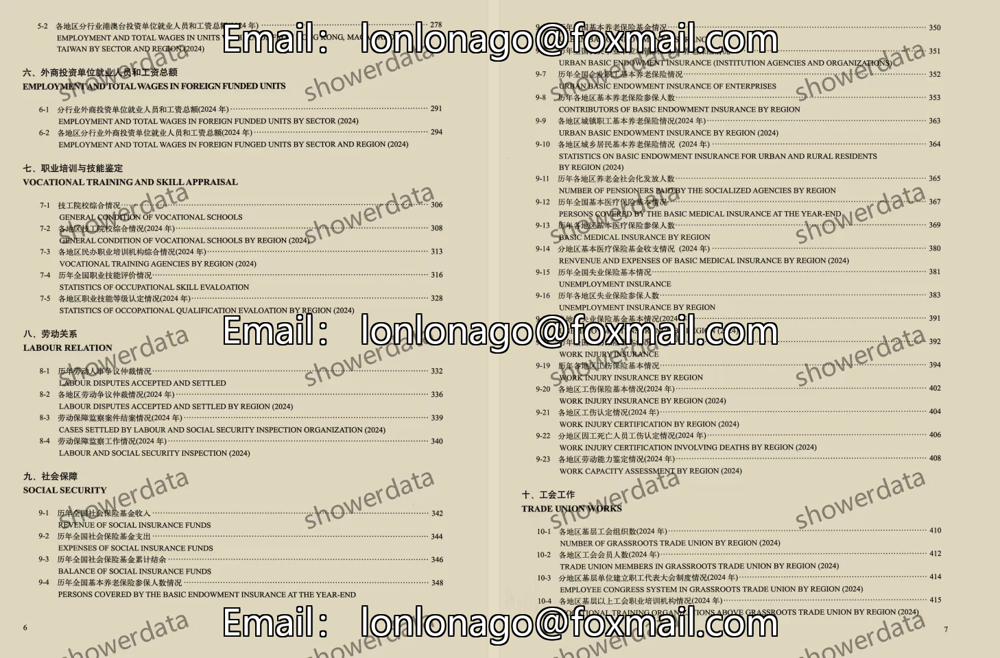
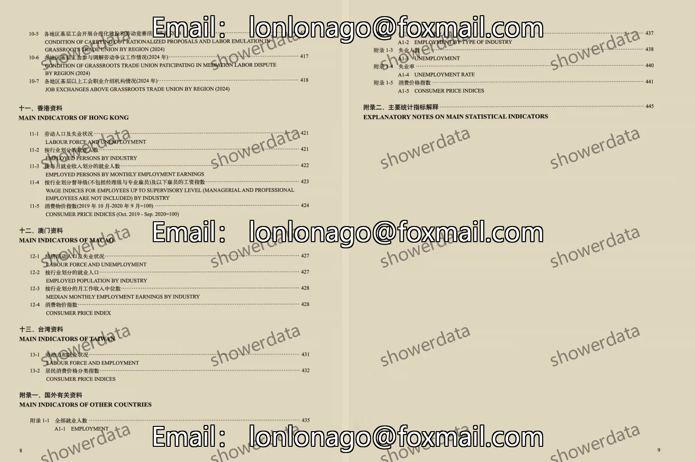

## Body

"China Labor Statistical Yearbook" (1989-2025)

Data Year: The publication year of the data is from 1989 to 2024. (The data year needs to be one less than the publication year).
Please check the image below before purchasing, as it fully displays the description. If you are sure about what you need, then purchase. After shipping, there will be no returns or exchanges for any reason!

01. Data Introduction
"China Labor Statistical Yearbook"

02. Indicator Details
(1) The directory is displayed in the image, please take a look and make your own purchase. There are many indicators, so if you can't find them, I won't help you. All information is here, and after shipping, there will be no return or exchange without any reason.
(2) The display directory is for the year 2025. Different statistical standards may change over time. Academic common sense is that the data recorded in statistical materials is the data from the previous year, which is also an academic common sense. Please be aware of this.
(3) The Excel format data is organized from original materials, including the content of the original material data but not the text content of the original material.
(4) If the material is placed in a zip file, you need to save the zip file first, download it, and then extract it.
(5) If there is Excel protection, you can select all and copy to a new sheet to use.

03. Data Content
Original Yearbook 1989-2025Pdf, Excel
Organized Panel 2000-2022
Please read carefully before purchasing, as it fully displays the description. If you are unsure about the format, do not purchase!

## Images

item_1005892401388

Here is a pay link on Stripe ( https://buy.stripe.com/3cs8yP7sY87d0vu9AB ). Please contact me lonlonago@foxmail.com after funding $89, and I will send you a complete data files , thank you!

